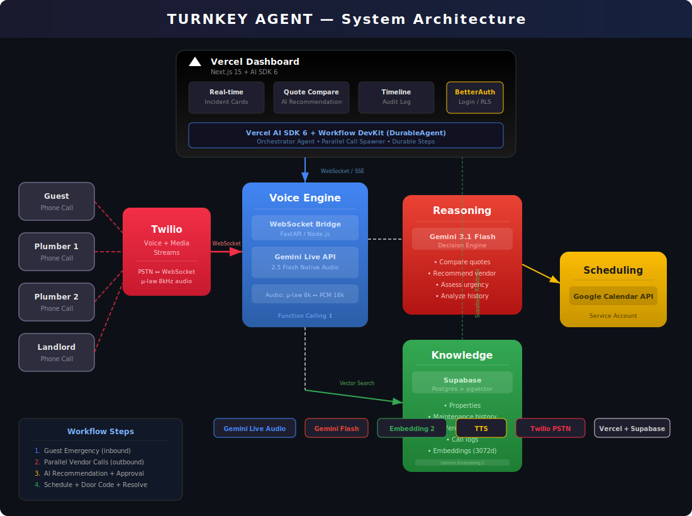

# Turnkey Agent

> AI property management agent that handles emergency maintenance end-to-end — from an angry guest's phone call to a plumber walking through the door — using real voice calls powered by Gemini.

**Vercel x Google DeepMind Hackathon | March 21, 2026**

> Architecture, implementation plan, and documentation by [Ben Shyong](https://github.com/Bshyong158)



---

## What It Does

Turnkey Agent automates the entire emergency maintenance workflow for short-term rental properties:

1. **Guest calls in** with an emergency (flooding bathroom, broken AC, etc.)
2. **Agent triages** the issue against 5 years of property maintenance history using vector search
3. **Agent parallel-calls vendors** for quotes — two plumbers simultaneously, each on a real phone call
4. **AI recommends** the best vendor based on price, speed, history, and ratings
5. **Agent calls the landlord** with a recommendation and gets approval
6. **Agent schedules the repair** and creates a calendar event
7. **Plumber arrives**, calls for the door code — agent verifies and provides access

Every interaction is a **real phone call** — not chat, not a simulation.

---

## Tech Stack

| Layer | Technology |
|---|---|
| Voice (Real-time) | Gemini 2.5 Flash Native Audio (Live API) |
| Voice (Async) | Gemini 2.5 Flash TTS |
| Telephony | Twilio Voice + Media Streams |
| Reasoning | Gemini 3.1 Flash |
| Embeddings | Gemini Embedding 2 |
| Database | Supabase (Postgres + pgvector) |
| Auth | BetterAuth |
| Frontend | Next.js 15 on Vercel |
| Orchestration | Vercel AI SDK 6 + Workflow DevKit |
| Scheduling | Google Calendar API |

---

## Documentation

| Document | Description |
|---|---|
| [Architecture](docs/architecture.md) | System architecture, tech stack, and component overview |
| [Database Schema](docs/database-schema.md) | Supabase tables, functions, and pgvector setup |
| [Voice Engine](docs/voice-engine.md) | Twilio ↔ Gemini Live API bridge and audio pipeline |
| [Dashboard](docs/dashboard.md) | Real-time Next.js dashboard specification |
| [Gemini Tools](docs/gemini-tools.md) | Function tools registered with the Gemini Live API |
| [Seed Data](docs/seed-data.md) | 5-year maintenance history generation (Phases 1–4) |
| [Demo Script](docs/demo-script.md) | 6-scene demo script with role-player call scripts |
| [Team Assignments](docs/team-assignments.md) | Workstreams, timeline, and judge alignment |
| [Risk Mitigation](docs/risk-mitigation.md) | Risk matrix and environment variables |

---

## Quick Start

### Prerequisites

- Node.js 20+
- Python 3.11+ (for voice bridge)
- Twilio account with a phone number
- Supabase project
- Google AI Studio API key
- Google Calendar service account

### Environment Variables

```bash
cp .env.example .env
# Fill in all values — see docs/risk-mitigation.md for the full list
```

### Setup

```bash
# Install dependencies
npm install

# Set up Supabase schema
# Run the SQL from docs/database-schema.md in your Supabase SQL editor

# Generate and embed seed data
python scripts/embed_and_upload.py

# Start the dashboard
npm run dev

# Start the voice bridge (separate terminal)
python bridge/server.py
```

---

## Architecture

```
Phone Call → Twilio → WebSocket Bridge → Gemini Live API
                                              ↕
                                     Function Calling
                                              ↕
                              Supabase ← → Vercel Dashboard
                                              ↕
                                      Google Calendar
```

See the full [architecture diagram](docs/architecture-diagram.svg) and [detailed docs](docs/architecture.md).

---

## Team

| Workstream | Name |
|---|---|
| **Voice Engine** (Product Lead / Architect) | Ben Shyong ([@Bshyong158](https://github.com/Bshyong158)) |
| **Data Layer** | Ayush Ojha ([@ayushozha](https://github.com/ayushozha)) |
| **Dashboard + Landlord UX** | Suet Ling Chow ([@lingchowc](https://github.com/lingchowc)) |
| **Orchestration + Glue** | Arnav Dewan ([@arnxv0](https://github.com/arnxv0)) |

Built for the Vercel x Google DeepMind Hackathon, March 2026.

---

## License

MIT
